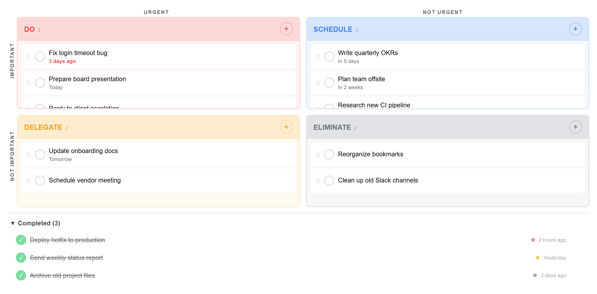
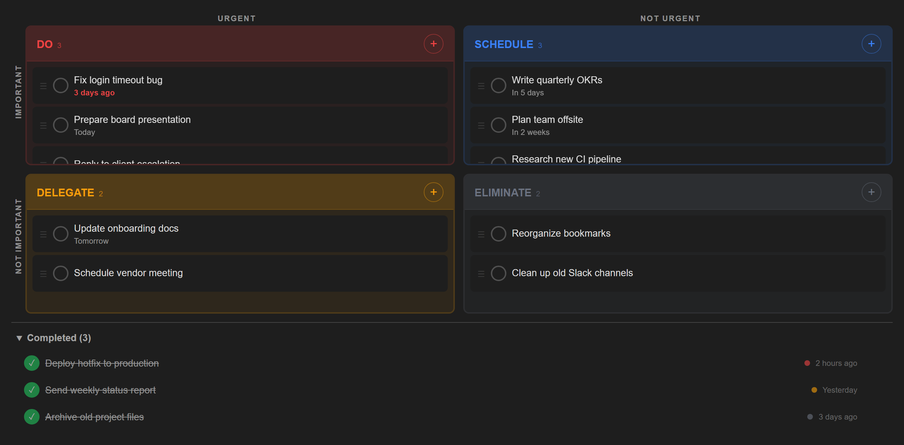
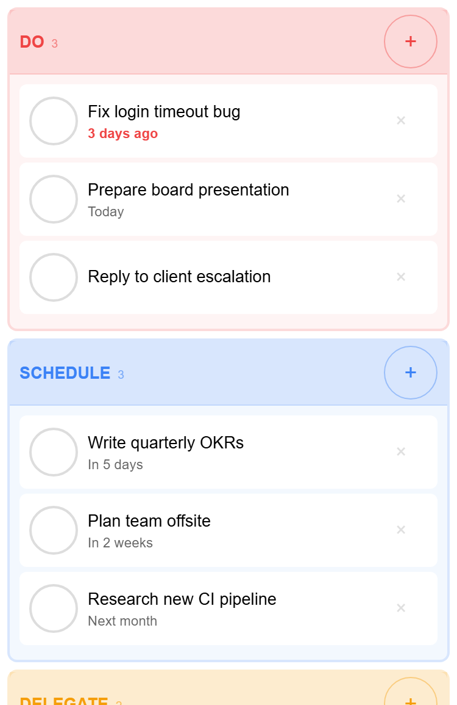
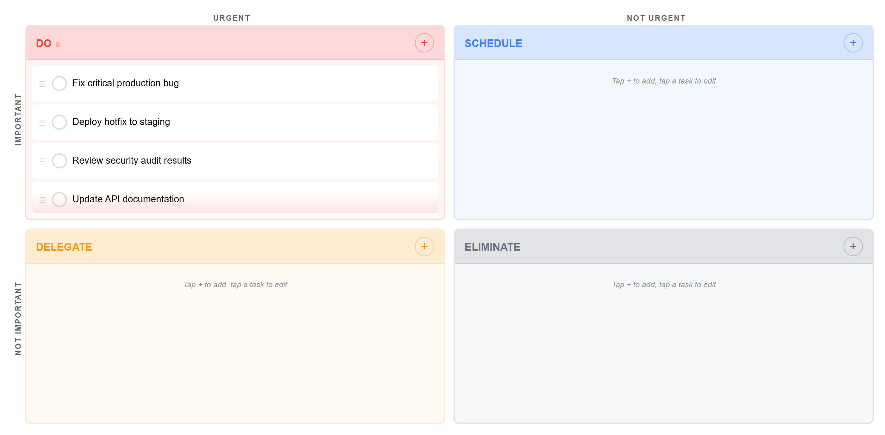

# Task Priority Matrix for Obsidian

Prioritize your tasks by urgency and importance, right inside Obsidian. Based on the classic Eisenhower Matrix method.




## Features

| Feature | Description |
|---------|-------------|
| **4-quadrant matrix** | Do, Schedule, Delegate, Eliminate — the classic Eisenhower layout |
| **Task completion** | Check off tasks with a single click — completed items move to a collapsible bin with timestamps |
| **Revive or delete** | Uncomplete a task to send it back to its quadrant, or delete it permanently |
| **Drag and drop** | Move tasks between quadrants on desktop. Long-press to drag on mobile |
| **Due dates** | Relative formatting (Today, Tomorrow, 3 days ago) with overdue highlighting |
| **Inline editing** | Click any task to edit its title or due date in place |
| **Task count badges** | Each quadrant header shows the number of active tasks at a glance |
| **Undo on actions** | Delete or complete a task by accident? A 5-second toast lets you undo instantly |
| **Overflow scrolling** | Quadrants scroll individually when overloaded — with a color-matched fade indicator |
| **Syncs across devices** | Works with Obsidian Sync — tasks update automatically on all devices |
| **Mobile friendly** | Responsive stacked layout with touch-friendly checkboxes and drag onboarding |
| **Theme aware** | Adapts to your light or dark Obsidian theme |

### Dark mode



### Mobile layout



### Overflow scrolling



## Installation

1. Open **Settings > Community plugins** in Obsidian
2. Turn off **Restricted mode** if prompted
3. Click **Browse** and search for **Task Priority Matrix**
4. Click **Install**, then **Enable**

## Usage

Open the matrix from the ribbon icon or the command palette (**Task Priority Matrix: Open matrix**).

- **Add a task** — tap the **+** button in any quadrant
- **Complete a task** — click the circle checkbox to mark it done
- **Edit a task** — click on it to change the title or due date
- **Move a task** — drag it to a different quadrant (long-press on mobile)
- **Revive a task** — click the green checkbox in the Completed section to bring it back
- **Delete a task** — click the **x** button (undo within 5 seconds)

## Development

```bash
npm install
npm run dev          # watch mode
npm run build        # production build
npm test             # unit tests (Jest)
npm run test:mobile  # mobile layout tests (Playwright)
npm run screenshots  # regenerate README screenshots
```

## License

[MIT](LICENSE)
